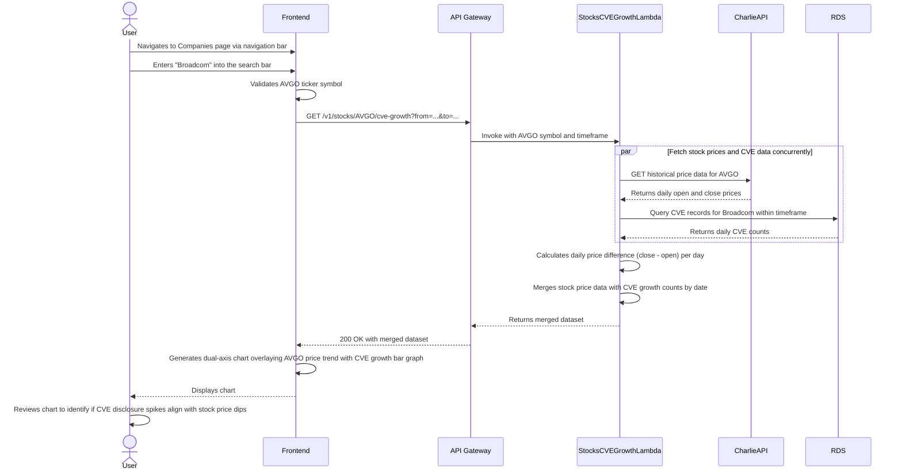

```mermaid
sequenceDiagram
    actor User
    participant Frontend
    participant API Gateway
    participant StocksCVEGrowthLambda
    participant CharlieAPI
    participant RDS

    User->>Frontend: Navigates to Companies page via navigation bar
    User->>Frontend: Enters "Broadcom" into the search bar

    Frontend->>Frontend: Validates AVGO ticker symbol

    Frontend->>API Gateway: GET /v1/stocks/AVGO/cve-growth?from=...&to=...
    API Gateway->>StocksCVEGrowthLambda: Invoke with AVGO symbol and timeframe

    par Fetch stock prices and CVE data concurrently
        StocksCVEGrowthLambda->>CharlieAPI: GET historical price data for AVGO
        CharlieAPI-->>StocksCVEGrowthLambda: Returns daily open and close prices

        StocksCVEGrowthLambda->>RDS: Query CVE records for Broadcom within timeframe
        RDS-->>StocksCVEGrowthLambda: Returns daily CVE counts
    end

    StocksCVEGrowthLambda->>StocksCVEGrowthLambda: Calculates daily price difference (close - open) per day
    StocksCVEGrowthLambda->>StocksCVEGrowthLambda: Merges stock price data with CVE growth counts by date

    StocksCVEGrowthLambda-->>API Gateway: Returns merged dataset
    API Gateway-->>Frontend: 200 OK with merged dataset

    Frontend->>Frontend: Generates dual-axis chart overlaying AVGO price trend with CVE growth bar graph

    Frontend-->>User: Displays chart
    User->>User: Reviews chart to identify if CVE disclosure spikes align with stock price dips
```