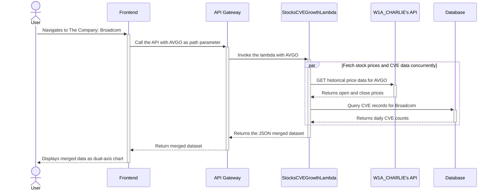

```mermaid
sequenceDiagram
    actor User
    participant Frontend
    participant Gateway as API Gateway
    participant Lambda as StocksCVEGrowthLambda
    participant Charlie as W1A_CHARLIE's API
    participant DB as Database

    activate User

    User->>+Frontend: Navigates to The Company: Broadcom

    Frontend->>+Gateway: Call the API with AVGO as path parameter
    Gateway->>+Lambda: Invoke the lambda with AVGO

    par Fetch stock prices and CVE data concurrently
        Lambda->>+Charlie: GET historical price data for AVGO
        Charlie-->>-Lambda: Returns open and close prices

        Lambda->>+DB: Query CVE records for Broadcom
        DB-->>-Lambda: Returns daily CVE counts
    end

    Lambda-->>-Gateway: Returns the JSON merged dataset
    Gateway-->>-Frontend: Return merged dataset

    Frontend-->>-User: Displays merged data as dual-axis chart
```