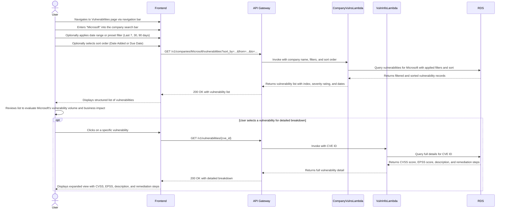

```mermaid
sequenceDiagram
    actor User
    participant Frontend
    participant API Gateway
    participant CompanyVulnsLambda
    participant VulnInfoLambda
    participant RDS

    User->>Frontend: Navigates to Vulnerabilities page via navigation bar
    User->>Frontend: Enters "Microsoft" into the company search bar
    User->>Frontend: Optionally applies date range or preset filter (Last 7, 30, 90 days)
    User->>Frontend: Optionally selects sort order (Date Added or Due Date)

    Frontend->>API Gateway: GET /v1/companies/Microsoft/vulnerabilities?sort_by=...&from=...&to=...
    API Gateway->>CompanyVulnsLambda: Invoke with company name, filters, and sort order

    CompanyVulnsLambda->>RDS: Query vulnerabilities for Microsoft with applied filters and sort
    RDS-->>CompanyVulnsLambda: Returns filtered and sorted vulnerability records

    CompanyVulnsLambda-->>API Gateway: Returns vulnerability list with index, severity rating, and dates
    API Gateway-->>Frontend: 200 OK with vulnerability list

    Frontend-->>User: Displays structured list of vulnerabilities

    User->>User: Reviews list to evaluate Microsoft's vulnerability volume and business impact

    opt User selects a vulnerability for detailed breakdown
        User->>Frontend: Clicks on a specific vulnerability
        Frontend->>API Gateway: GET /v1/vulnerabilities/{cve_id}
        API Gateway->>VulnInfoLambda: Invoke with CVE ID

        VulnInfoLambda->>RDS: Query full details for CVE ID
        RDS-->>VulnInfoLambda: Returns CVSS score, EPSS score, description, and remediation steps

        VulnInfoLambda-->>API Gateway: Returns full vulnerability detail
        API Gateway-->>Frontend: 200 OK with detailed breakdown

        Frontend-->>User: Displays expanded view with CVSS, EPSS, description, and remediation steps
    end
```