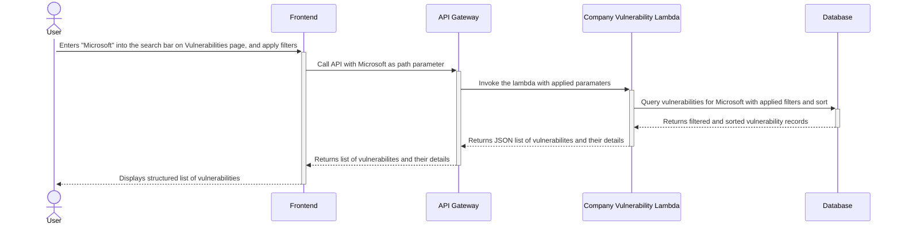

```mermaid
sequenceDiagram
    actor User
    participant Frontend
    participant Gateway as API Gateway
    participant Lambda as Company Vulnerability Lambda
    participant DB as Database

    activate User

    User->>+Frontend: Enters "Microsoft" into the search bar on Vulnerabilities page, and apply filters

    Frontend->>+Gateway: Call API with Microsoft as path parameter
    Gateway->>+Lambda: Invoke the lambda with applied paramaters

    Lambda->>+DB: Query vulnerabilities for Microsoft with applied filters and sort
    DB-->>-Lambda: Returns filtered and sorted vulnerability records

    Lambda-->>-Gateway: Returns JSON list of vulnerabilites and their details
    Gateway-->>-Frontend: Returns list of vulnerabilites and their details

    Frontend-->>-User: Displays structured list of vulnerabilities
```