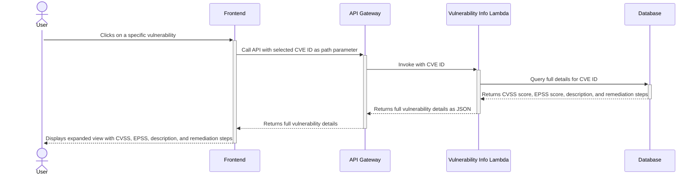

```mermaid
sequenceDiagram
    actor User
    participant Frontend
    participant Gateway as API Gateway
    participant Lambda as Vulnerability Info Lambda
    participant DB as Database

    activate User

    User->>+Frontend: Clicks on a specific vulnerability
    Frontend->>+Gateway: Call API with selected CVE ID as path parameter
    Gateway->>+Lambda: Invoke with CVE ID

    Lambda->>+DB: Query full details for CVE ID
    DB-->>-Lambda: Returns CVSS score, EPSS score, description, and remediation steps

    Lambda-->>-Gateway: Returns full vulnerability details as JSON
    Gateway-->>-Frontend: Returns full vulnerability details

    Frontend-->>-User: Displays expanded view with CVSS, EPSS, description, and remediation steps
```