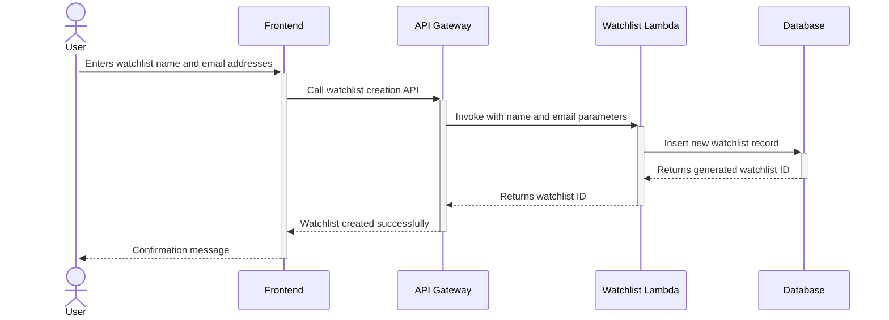

```mermaid
sequenceDiagram
    actor User
    participant Frontend
    participant API Gateway
    participant Lambda as Watchlist Lambda
    participant DB as Database

    activate User

    User->>+Frontend: Enters watchlist name and email addresses

    Frontend->>+API Gateway: Call watchlist creation API
    API Gateway->>+Lambda: Invoke with name and email parameters
    Lambda->>+DB: Insert new watchlist record
    DB-->>-Lambda: Returns generated watchlist ID
    Lambda-->>-API Gateway: Returns watchlist ID
    API Gateway-->>-Frontend: Watchlist created successfully

    Frontend-->>-User: Confirmation message
```