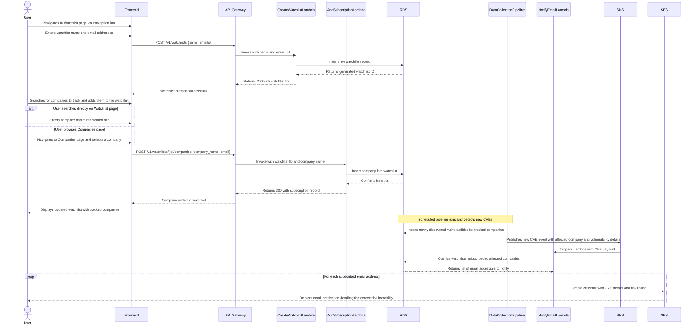

```mermaid
sequenceDiagram
    actor User
    participant Frontend
    participant API Gateway
    participant CreateWatchlistLambda
    participant AddSubscriptionLambda
    participant RDS
    participant DataCollectionPipeline
    participant NotifyEmailLambda
    participant SNS
    participant SES

    User->>Frontend: Navigates to Watchlist page via navigation bar
    User->>Frontend: Enters watchlist name and email addresses

    Frontend->>API Gateway: POST /v1/watchlists {name, emails}
    API Gateway->>CreateWatchlistLambda: Invoke with name and email list
    CreateWatchlistLambda->>RDS: Insert new watchlist record
    RDS-->>CreateWatchlistLambda: Returns generated watchlist ID
    CreateWatchlistLambda-->>API Gateway: Returns 200 with watchlist ID
    API Gateway-->>Frontend: Watchlist created successfully

    User->>Frontend: Searches for companies to track and adds them to the watchlist

    alt User searches directly on Watchlist page
        User->>Frontend: Enters company name into search bar
    else User browses Companies page
        User->>Frontend: Navigates to Companies page and selects a company
    end

    Frontend->>API Gateway: POST /v1/watchlists/{id}/companies {company_name, email}
    API Gateway->>AddSubscriptionLambda: Invoke with watchlist ID and company name
    AddSubscriptionLambda->>RDS: Insert company into watchlist
    RDS-->>AddSubscriptionLambda: Confirms insertion
    AddSubscriptionLambda-->>API Gateway: Returns 200 with subscription record
    API Gateway-->>Frontend: Company added to watchlist

    Frontend-->>User: Displays updated watchlist with tracked companies

    Note over DataCollectionPipeline, RDS: Scheduled pipeline runs and detects new CVEs

    DataCollectionPipeline->>RDS: Inserts newly discovered vulnerabilities for tracked companies
    DataCollectionPipeline->>SNS: Publishes new CVE event with affected company and vulnerability details

    SNS->>NotifyEmailLambda: Triggers Lambda with CVE payload

    NotifyEmailLambda->>RDS: Queries watchlists subscribed to affected companies
    RDS-->>NotifyEmailLambda: Returns list of email addresses to notify

    loop For each subscribed email address
        NotifyEmailLambda->>SES: Send alert email with CVE details and risk rating
        SES-->>User: Delivers email notification detailing the detected vulnerability
    end
```