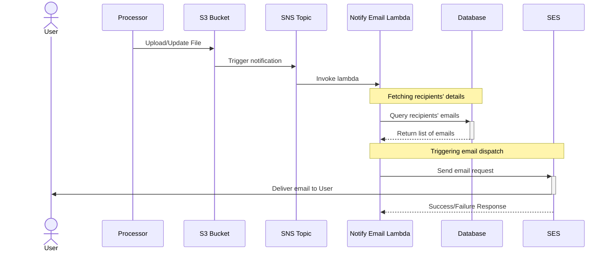

```mermaid
sequenceDiagram
    actor U as User
    participant P as Processor
    participant S3 as S3 Bucket
    participant SNS as SNS Topic
    participant L as Notify Email Lambda
    participant DB as Database
    participant SES as SES 

    P->>S3: Upload/Update File
    S3->>SNS: Trigger notification
    SNS->>L: Invoke lambda
    
    Note over L,DB: Fetching recipients' details
    L->>+DB: Query recipients' emails
    DB-->>-L: Return list of emails
    
    Note over L,SES: Triggering email dispatch
    L->>+SES: Send email request
    SES->>-U: Deliver email to User
    SES-->>L: Success/Failure Response
```